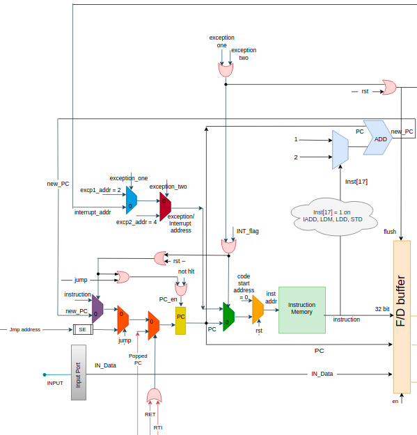
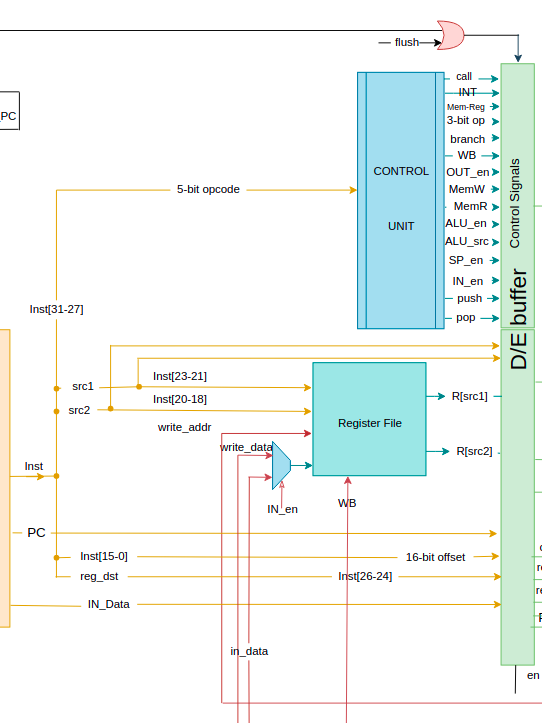
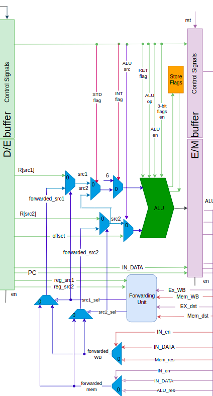

# MIPS Processor(Harvard Architecture)

 

  
    
 

<h4>A Simple 5-stage 32-bit pipelined processor with Harvard architecture and a RISC-like instruction set architecture.  
In addition to an assembler to decode assembly code files to fill the instruction memory with the right data </h4>

      

## ⚙ ISA Specifications

<ol>
  <li>
<b>Registers:</b> 
<ul>
  <li><b>R[0:7]</b>: Eight <b>16-bit</b> general purpose registers</li>
  <li><b>PC</b>: <b>32-bit</b> program counter register</li>
  <li><b>SP</b>: <b>32-bit</b> Stack Pointer register</li>
  <li><b>EPC</b>: <b>32-bit</b> Exception Program Counter register</li>
  <li><b>CCR</b>: Condition Code Register
    <ul>
      <li>Z: zero flag</li>
      <li>N: negative flag</li>
      <li>C: carry flag</li>
    </ul>
  </li>
</ul>
</li>
    <li>
      <b>Ports:</b> 
      <ul>
        <li><b>IN</b> port: <b>16-bit</b> data input port</li>
        <li><b>OUT</b> port: <b>16-bit</b> data output port</li>
      </ul>
</li>
   </ol>

### 📋 Instruction Set
| One Operand Instructions | Two Operand Instructions  |  Memory Instructions |  Branch Instructions |
|---|---|---|---|
| NOP  |  MOV Rsrc, Rdst |  PUSH Rsrc |  JZ Rdst |
| HLT  | ADD Rdst, Rsrc1, Rsrc2  |  POP Rdst |  JC Rdst |
|  SETC |SUB Rdst, Rsrc1, Rsrc2   | LDM Rdst, Imm  | JN Rdst  |
|  NOT Rdst| AND Rdst, Rsrc1, Rsrc2  | LDD Rdst, offset(Rsrc)  | JMP Rdst  |
|  INC Rdst|  IADD Rdst, Rsrc1, Imm | STD Rsrc1, offset(Rsrc2)  | CALL Rdst  |
|  OUT Rsrc | -  | -  | RET  (for call)|
|  IN Rdst |   - | -  |  INT index |
| - |  - | -  |  RTI (for interrupt)|

## 🎗 Features

- reset signal

- Successful hazards detection and handling (using full forwarding)

- Successful Interrupts calling

- Successful Exceptions handling
  
  - Exception 1: empty stack
  
  - Exception 2: invalid addess  
  
## 🔄 Pipeline Stages

<ul>
<li>
<h3> 1️⃣ <b>Fetch Stage</b></h3>

</li>
 

<li>
<h3> 2️⃣ <b>Decode Stage</b></h3>

</li>

<li>
<h3> 2️⃣ <b>Execute Stage</b></h3>

</li>
</ul>

 <h2>  Contributors  
 </h2>

<table>
  <tr>
    <td align="center"><a href="https://github.com/mohamed99akram"> <b>Mohamed Akram</b></a> 
    </td>
    <td align="center"><a href="https://github.com/Passant-Abdelgalil"> <b>Passant Abdelgalil</b></a> 
    </td><td align="center"><a href="https://github.com/mariamashraf00"> <b>Mariam Malak</b></a> 
    </td><td align="center"><a href="https://github.com/esraagamal23"> <b>Esraa Gamal</b></a> 
    </td>
    </tr>
  </table>

